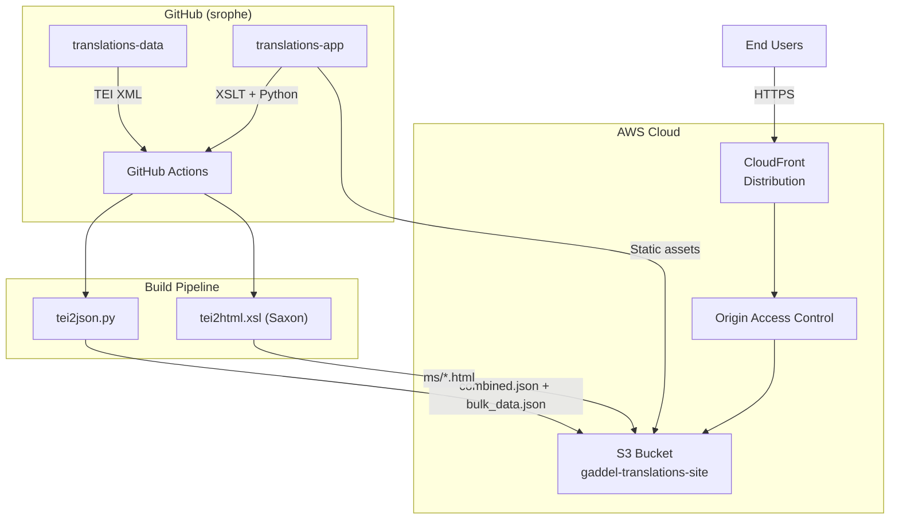

# Translations App

A static publishing platform for Syriac text translations, part of the [Syriaca.org](http://syriaca.org) digital humanities project. Translations are encoded in TEI XML, transformed to HTML and JSON, and served as a static site via AWS CloudFront.

## Architecture



## Project Structure

```
translations-app/
├── .github/workflows/
│   ├── codeToAWS.yml       # Deploy static assets to S3
│   └── dataToAWS.yml       # Process TEI → JSON + HTML, upload to S3
├── data/                    # Pre-built HTML pages for translations
├── documentation/schema/    # TEI schema (RelaxNG)
├── infrastructure/
│   └── cloudformation.yml   # AWS stack (S3, CloudFront, OAC, IAM)
├── json/
│   └── combined.json        # Aggregated search data for client-side search
├── resources/
│   ├── bootstrap/           # Bootstrap CSS/JS
│   ├── components/          # Shared HTML components
│   ├── css/                 # Stylesheets
│   ├── jquery-ui/           # jQuery UI
│   ├── js/                  # Client-side JS (navbar, search)
│   └── keyboard/            # Syriac virtual keyboard
├── siteGenerator/
│   ├── components/          # Page templates, repo-config.xml
│   └── xsl/                 # XSLT stylesheets for TEI transformation
├── index.html               # Homepage
└── tei2json.py              # Python TEI → JSON extraction script
```

## Data Pipeline

The `dataToAWS.yml` workflow runs on push to the code repo's main branch and by workflow dispatch:

1. Checks out both `translations-app` (code) and `translations-data` (TEI XML)
2. Runs `tei2json.py` to extract searchable JSON from TEI files
3. Runs Saxon XSLT (`tei2html.xsl`) to convert TEI XML → HTML pages in parallel
4. Uploads JSON to S3 for search indexing
5. Syncs HTML pages (`ms/`) and TEI XML (`tei/`) to S3
6. Invalidates CloudFront cache
7. Commits updated `combined.json` back to the repo

## TEI to JSON Conversion

The `tei2json.py` script extracts searchable fields from TEI XML for client-side search:

```bash
# Single file
python3 tei2json.py path/to/file.xml --pretty

# Directory → individual JSON files
python3 tei2json.py path/to/tei/ -o json_output/

# Directory → single combined.json for client-side search
python3 tei2json.py path/to/tei/ --combined json/combined.json
```

Output fields:
- `title` — array of titles from titleStmt
- `displayTitleEnglish` — formatted display title
- `author` — author names
- `translator` — translator names
- `idno` — URI identifier
- `type` — document type
- `series` — series titles
- `persName` — person names referenced in the text
- `placeName` — place names referenced in the text
- `fullText` — full body text for keyword search

## Local Development

### Static Site

```bash
git clone https://github.com/srophe/translations-app.git
cd translations-app
python3 -m http.server 8000
```

Open http://localhost:8000. Search works client-side using `json/combined.json`.

### Regenerate JSON from TEI

```bash
# Clone the data repo alongside the app
git clone https://github.com/srophe/translations-data.git

# Generate combined search JSON
python3 tei2json.py translations-data/tei/ --combined json/combined.json --pretty
```

### Regenerate HTML from TEI

Requires [Saxon-HE](https://www.saxonica.com/download/java.xml):

```bash
java -jar saxon.jar -s:translations-data/tei/10510.xml -xsl:siteGenerator/xsl/tei2html.xsl -o:data/10510.html
```

Or batch convert all files:
```bash
for f in translations-data/tei/*.xml; do
  id=$(basename "$f" .xml)
  java -jar saxon.jar -s:"$f" -xsl:siteGenerator/xsl/tei2html.xsl -o:"data/${id}.html"
done
```

## Deployment

### AWS (Production)

Infrastructure is defined in `infrastructure/cloudformation.yml`:
- S3 bucket with full public access block
- CloudFront distribution with HTTPS redirect
- Origin Access Control (OAC) for secure S3 access
- GitHub OIDC deploy role (no stored credentials)

Two workflows handle deployment:
- `codeToAWS.yml` — syncs static assets (HTML, CSS, JS) on code changes
- `dataToAWS.yml` — processes TEI data and uploads HTML/JSON on data changes

### GitHub Pages

For a free alternative:
1. Go to repo **Settings → Pages → Source → GitHub Actions**
2. Fix root-relative paths: `find . -name "*.html" -exec sed -i '' 's|href="/resources|href="./resources|g; s|src="/resources|src="./resources|g' {} +`
3. Site will be at `https://srophe.github.io/translations-app/`

## Frontend Stack

- Bootstrap 3
- jQuery + jQuery UI
- Syriac virtual keyboard (phonetic, standard, Arabic, Greek, Russian)

## License

Content licensed under [Creative Commons Attribution 4.0 International (CC BY 4.0)](https://creativecommons.org/licenses/by/4.0/).
